# LinkPulse - Premium URL Shortener & Analytics

LinkPulse is a complete, production-ready, highly visual URL shortener application. It offers secure user authentication, URL validation, custom alias creation, expiration date restrictions, QR code generation, and interactive click analytics.

## 🚀 Key Features
- **Secure Authentication**: JWT-based session state with encrypted storage via bcrypt.
- **Shortener Engine**: Generates unique identifiers using `nanoid` or lets users define custom aliases.
- **Expiration System**: Campaign links automatically expire at a chosen time.
- **Interactive QR Codes**: Dynamic vector QR codes generated locally with options to download as PNG.
- **Visit Log Analytics**: Visual tracking using Area, Pie, and Bar charts in Recharts showing clicks, browser engines, device types, and click histories.

---

## 📐 System Architecture

Below is the visual flow of client requests, authentications, redirections, and analytics tracking:

```mermaid
sequenceDiagram
    autonumber
    actor User as User Browser
    participant FE as React Client (Vite)
    participant BE as Express Server
    participant DB as MongoDB

    %% Auth Flow
    rect rgb(20, 30, 45)
    Note over User, DB: User Sign In
    User->>FE: Enter Credentials
    FE->>BE: POST /api/auth/login
    BE->>DB: Query User & verify password hash
    DB-->>BE: User found & matched
    BE-->>FE: Return User & Signed JWT Token
    FE->>User: Set local storage session
    end

    %% Create Short Link
    rect rgb(25, 40, 25)
    Note over User, DB: URL Shortening
    User->>FE: Inputs Long URL (with Custom Alias/Expiration)
    FE->>BE: POST /api/urls (with JWT Authorization Bearer header)
    BE->>BE: Validate URL format & verify alias uniqueness
    BE->>DB: Write Url document
    DB-->>BE: Saved successfully
    BE-->>FE: Return URL document with shortCode
    FE-->>User: Trigger Success Confetti & Display Copy button
    end

    %% Click Redirection
    rect rgb(45, 20, 20)
    Note over User, DB: Visitor Redirection & Logging
    actor Visitor as External Link Clicker
    Visitor->>BE: GET /:shortCode
    BE->>DB: Query target URL
    DB-->>BE: URL Document
    alt URL not found OR URL expired
        BE-->>Visitor: Redirect to Client /404 (with ?error=expired if past date)
    else URL active
        BE->>BE: Parse browser & device type (User-Agent parsing)
        BE->>DB: Increment click count AND Write Visit analytics record (async)
        BE-->>Visitor: 302 Redirect to destination (originalUrl)
    end
    end
```



---

## 🛠️ Tech Stack
- **Frontend**: React.js (Vite), React Router v6, Tailwind CSS, Axios, Recharts, `qrcode.react`, `canvas-confetti`.
- **Backend**: Node.js, Express.js, `jsonwebtoken`, `bcryptjs`, `nanoid`, `ua-parser-js`, `validator`.
- **Database**: MongoDB (Atlas or local), Mongoose ODM.

---

## ⚙️ Setup and Installation

### Prerequisites
- [Node.js](https://nodejs.org) (v18+ recommended)
- [MongoDB](https://www.mongodb.com/try/download/community) installed locally OR a [MongoDB Atlas](https://www.mongodb.com/cloud/atlas) account.

### Step 1: Clone and Configuration
Under `d:/LinkPulse/`, configure environment variables.

#### Server Environment Setup
Create `server/.env`:
```env
PORT=5000
MONGODB_URI=mongodb://localhost:27017/linkpulse
JWT_SECRET=your_super_secure_jwt_secret_key
CLIENT_URL=http://localhost:5173
NODE_ENV=development
```

### Step 2: Install Server Dependencies
Open a terminal in the `server` directory and run:
```bash
cd server
npm install
```

To run the server in development mode (with hot reloading):
```bash
npm run dev
```
The server will boot up on `http://localhost:5000`.

### Step 3: Install Client Dependencies
Open a terminal in the `client` directory and run:
```bash
cd client
npm install
```

Create a client environment file if needed, e.g., `client/.env.local` to override API endpoint defaults:
```env
VITE_API_URL=http://localhost:5000/api
```

To run the client Vite development server:
```bash
npm run dev
```
The client dashboard will open at `http://localhost:5173`.

---

## 📡 Backend REST API Endpoints

### Authentication
- `POST /api/auth/signup`: Registers a new user. Expects JSON `{ name, email, password }`.
- `POST /api/auth/login`: Logs in. Expects JSON `{ email, password }`. Returns JWT.

### URL Operations (Requires Bearer Token)
- `POST /api/urls`: Creates a shortened URL. Expects `{ originalUrl, customAlias (optional), expiresAt (optional) }`.
- `GET /api/urls`: Lists all URLs created by the authenticated user.
- `DELETE /api/urls/:id`: Deletes a URL and its visit history.

### Analytics (Requires Bearer Token)
- `GET /api/urls/:id/analytics`: Returns structured click analysis charts and visitor histories.

### Redirection
- `GET /:shortCode`: Captures click, parses User-Agent headers, logs visit, and triggers 302 redirect.

---

## 🚀 Deployment Instructions

### Production Build Preparation
To verify client compilation:
```bash
cd client
npm run build
```
This generates a static build in `client/dist`.

---

### Backend Deployment (Render)
1. Sign in to [Render](https://render.com).
2. Click **New +** and choose **Web Service**.
3. Connect your Git repository.
4. Set the following configuration settings:
   - **Environment**: `Node`
   - **Build Command**: `cd server && npm install`
   - **Start Command**: `cd server && npm start`
5. Under **Advanced**, add the environment variables:
   - `MONGODB_URI`: *Your MongoDB Atlas Connection URL*
   - `JWT_SECRET`: *A secure random secret*
   - `CLIENT_URL`: *Your final Vercel frontend URL*
   - `NODE_ENV`: `production`

---

### Frontend Deployment (Vercel)
1. Sign in to [Vercel](https://vercel.com).
2. Choose **Add New Project** and import your Git repository.
3. Configure the following project parameters:
   - **Framework Preset**: `Vite`
   - **Root Directory**: `client`
   - **Build Command**: `npm run build`
   - **Output Directory**: `dist`
4. Add the following **Environment Variable**:
   - `VITE_API_URL`: *Your Render backend service API URL (e.g. `https://linkpulse-api.onrender.com/api`)*
5. Click **Deploy**. Vercel will build the frontend assets and distribute them globally.

## 🏗️ System Architecture

<p align="center">

</p>

## 🎥 Video Explanation

Watch the complete project explanation and demo here:

▶️ YouTube Video: [Add your YouTube Link Here]
